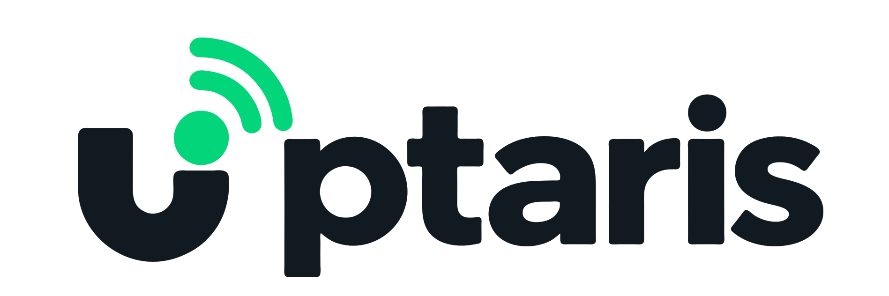

  <picture>
    <source media="(prefers-color-scheme: dark)" srcset=".github/assets/logo-full-dark.svg">
    
  </picture>

  Infrastruktūros stebėjimas — kokybiškas ir aiškus kiekvienos paslaugos vaizdas.

  <a href="README.md">English</a>

## Apie projektą

Uptaris - paprasčiausia vieta infrastruktūros stebėjimui. Stebėkite serverius ir paslaugas, anksčiau pastebėkite incidentus ir visada matykite paslaugų būseną.

## Technologijos

- React + Vite naudotojo sąsaja
- Go + Gin REST API
- PostgreSQL + GORM duomenims

## Instrukcijos

Žr. angliškas [kūrimo](docs/development.md) ir [diegimo](docs/build.md) instrukcijas.

## Licencija

Projektas licencijuojamas pagal [PolyForm Internal Use License 1.0.0](LICENSE). Platinti neleidžiama.
